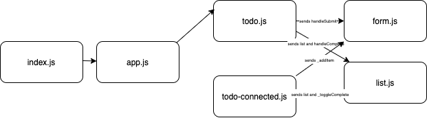

# To Do List
### Aysia Brown

### Challenge:
Refactor React Class Components into Functional Components while maintaining core functionality of the application. Add styling via Bootstrap library.

### Resources
- [GH-Pages Frontend](https://aysiabrown-401d39-advanced-javascript.github.io/todo/)
- [To Do API](https://aysiab-basic-api-server.herokuapp.com/todo)

### Setup
- Run `npm i` to install all the dependencies from within your cloned repo 
- Run `npm start` to start the application locally from your cloned repo 

### UML

### Tests
- Tests need to be built